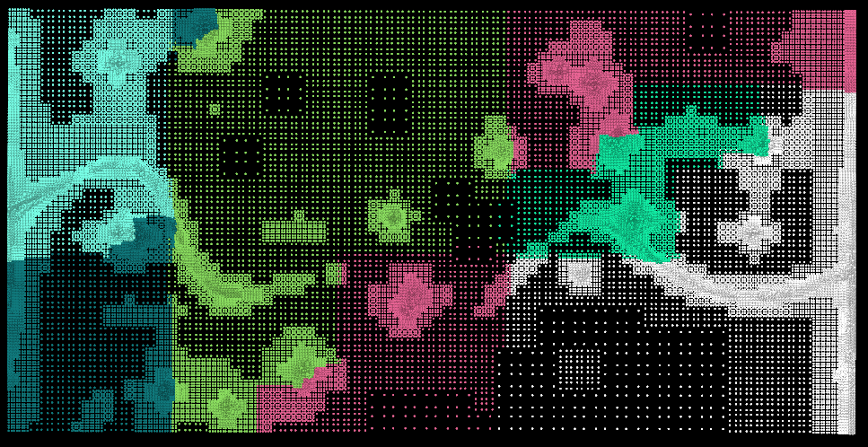

redist
====
Overview
---
redist is a small utility program that modifies the velocity output generated by [NPSAT](https://gwt.ucdavis.edu/research-tools-and-applications/npsat-engine) so that it can be used by [Ichnos](https://github.com/giorgk/ichnos).

When the NPSAT is executed in a multi-core mode then each core prints the locally owned velocity field in its own file. NPSAT is based on [deal.II](https://www.dealii.org/) which in turn uses [p4est](https://www.p4est.org/) to deal with the distribution of degrees of freedom (dofs) to different processors. This results in a distribution of dofs which look like the following:

We can see that p4est distribution creates subdomains without considering any proximity constrains. It is very likely that one domain main contain dofs that ther are totally disconnected in the physical space. While this is acceptable when solving linear systems, it causes quite a few problems on particle tracking codes.

Therefore the purpose of this utility program is to redistrube the dofs into a regular pattern that can be used by [Ichnos](https://github.com/giorgk/ichnos).

How to use
---
