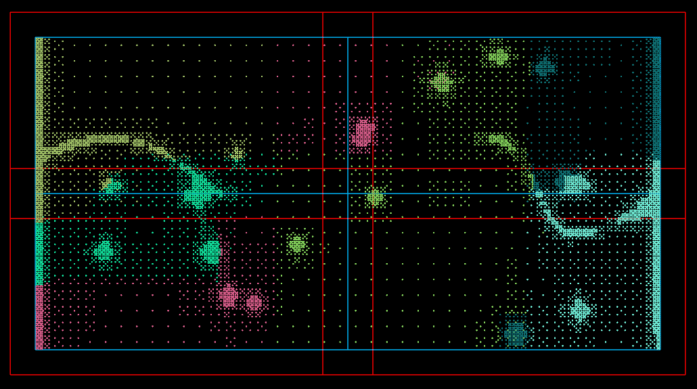

redist
====
Overview
---
redist is a small utility program that modifies the velocity output generated by [NPSAT](https://gwt.ucdavis.edu/research-tools-and-applications/npsat-engine) so that it can be used by [Ichnos](https://github.com/giorgk/ichnos).

When the NPSAT is executed in a multi-core mode each core prints the locally owned velocity field in its own file. NPSAT is based on [deal.II](https://www.dealii.org/) which in turn uses [p4est](https://www.p4est.org/) to deal with the distribution of degrees of freedom (dofs) to different processors. This results in a distribution of dofs which look like the following:



The coloured dots correspond to nodes where the velocity is known from the finite element solution. The dots of the same color belong to the same processor. We can see that p4est distribution creates subdomains that are very irregular. It is also very likely that one domain may contaisn dofs that ther are totally disconnected in the physical space. While this is acceptable when solving linear systems, it causes quite a few problems on particle tracking codes.

Therefore the purpose of this utility program is to redistrube the dofs into a regular pattern that can be used by [Ichnos](https://github.com/giorgk/ichnos). In the above example the pattern is to split the nodes into 4 ractangular domains which are shown here with blue lines. These are called __Actual__ domains in the redist terminology. In particle tracking, when a particle exits the subdomain it is very usefull to know in which subdomain should go. We have found also that it is very usefull each processor to know the velocities for a layer of points around the subdomain. Therefore redist expects a number of __Expanded__ polygons which contain the velocity points to be printed into file.       

How to use
---
First prepare an input file such as the following
```
6 example1_v2_ 4 .vel
6 0 0 0 1 0 0
6 6 6 0 2 2
example1_actual_dom.dat example1_expanded_dom.dat
examp1_v2_new_
```
Number of domains in the FEM simulation - 
Prefix -
Size of zero padding -
Suffix </br>
The number of fields after the coordinates and the field type. 0 for double, 1 for integer </br>
The precision for the doubles in the new file </br> 
Filename with the actual domains -
Filename with the expanded domains </br>
New prefix

In the example above the left lower corner has coordinates (-5000, -2500) and the upper right corner (5000, 2500). The actual and expanded domain files that correspond to the above figure with blue and red rectangles respectively can be found under this repository

Then run the code using as many cores as the number of polygons in the actual and expanded domain files. For this example this is 4 i.e.
```
cd Example_data
C:\"Program Files\Microsoft MPI"\Bin\mpiexec.exe -n 4 ..\Debug\redist.exe example1_input.txt
```
The above assumes that the redist executable and the input files are all in the same folder.

